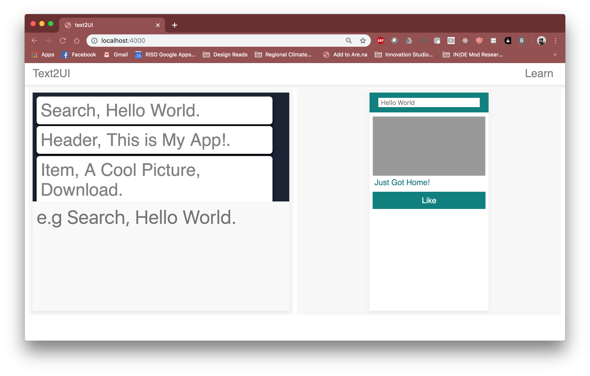

# text2UI
Experimental wireframing tool using text commands to generate UI

# About
Text2UI is a design tool aimed at the rapid generation of digital wireframes. Wireframes are low fidelity mockups of interfaces, used to delineate visual heirarchies, interaction flows, and stylings. More often than not wireframes are artifacts of the design process, left behind with each iteration. In order to speed up the process of generating these wireframes, text2UI uses a lexical format and a set of predefined UI in order to allow the designer to translate written commands into automatically generated screens. 

# Format 
Currently text2UI uses a lexical format as follows:

Element Name, Metadata.

Where the commas separate element name and metadata, and the period marks the end of the command. The current elements available are:

## Elements

Search, Placeholder Text.

Header, Header Text.

Item, Item Title, Button Title.

Button, Button Text. 

